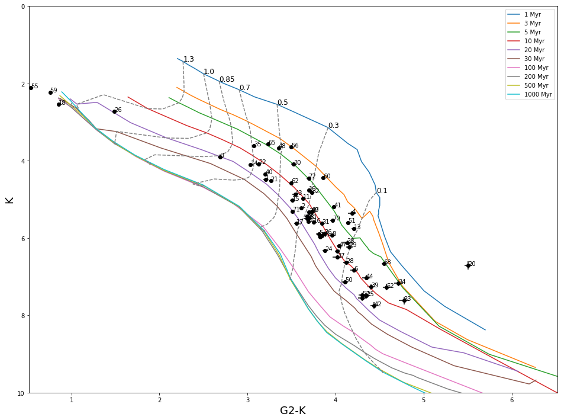

CMDs
=====

Color-magnitude diagrams (CMD) are commonly used in astronomy when dealing with stellar populations; not only do they provide a useful way to visualize stellar properties, but also they are underneath the logic of any photometry-based parameter estimation method, including MADYS. MADYS includes a function, :py:func:`SampleObject.CMD`, to handle the creation and the customization of CMDs based on an existing ``SampleObject`` instance.

A minimal working code is provided below:

>>> from madys import *
>>> # object is a previously created SampleObject instance
>>> object.CMD('G-K','K','bhac15')

The command will produce the following figure:

Customizable parameters include the following:

* col: string, required. Quantity to be plotted along the x axis (e.g.: 'G' or 'G-K')
* mag: string, required. Quantity to be plotted along the y axis (e.g.: 'G' or 'G-K')
* model_version: string, required. Selected model_version. Use :py:func:`ModelHandler.available` for further information on the available models.
* plot_ages: numpy array or bool, optional. It can be either:

   * a numpy array containing the ages (in Myr) of the isochrones to be plotted;
   * False, not to plot any isochrone. Default: [1,3,5,10,20,30,100,200,500,1000].
* plot_masses: numpy array or bool, optional. It can be either:

   * a numpy array containing the masses (in M_sun) of the tracks to be plotted.
   * False, not to plot any track. Default: [0.1,0.3,0.5,0.7,0.85,1.0,1.3,2].
* all valid keywords for a ``IsochroneGrid`` object, optional.
* ids: list or numpy array of integers, optional. Array of indices, selects the subset of input data to be drawn.
* xlim: list, optional. A two-element list with minimum and maximum value for the x axis.
* ylim: list, optional. A two-element list with minimum and maximum value for the y axis.
* groups: list or numpy array of integers, optional. Draws different groups of stars in different colors. The i-th element is a number, indicating to which group the i-th star belongs. Default: None.
* group_list: list or numpy array of strings, optional. Names of the groups defined by the 'groups' keyword. No. of elements must match the no. of groups. Default: None.
* label_points: bool, optional. Draws a label next to each point, specifying its row index. Default: True.
* figsize: tuple or list, optional. Figure size. Default: (16,12).
* tofile: bool or string, optional. If True, saves the output to as .png image. To change the file name, provide a string as full path of the output file. Default: False.
