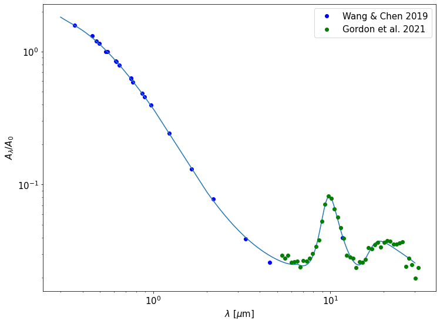

Interstellar extinction
====

Extinction maps
------------

By default, when a ``SampleObject`` instance is initialized, an estimate of the interstellar reddening E(B-V) in the direction of each target is automatically performed by the method :py:func:`SampleObject.interstellar_ext` and stored into the dedicated ``ebv`` attribute. Given its potential relevance, we decided to make this function a static method  that could be easily operable in stand-alone mode.

The estimate of extinction (reddening) in a given band (color) is performed by integrating along the line of sight a suitable 3D extinction map. The integration algorithm -- whose basic idea can be compared to Xiaolin Wu's line algorithm -- draws a line from the position of the Sun toward that of the star of interest; the value of each pixel crossed by the line is weighted according to the portion of the total distance spent by the line in the pixel itself. This method ensures a rapid and precise evaluation of the integral, allowing 10000 stars to be handled in ∼ 1 s under typical PC performances.

In stand-alone mode, the X-band extinction towards a list of stars would be computed through a command such as:

.. code-block:: python

   result = SampleObject.interstellar_ext(ra=ra_array,dec=dec_array,par=parallax_array,ext_map='leike',color='X')

where ``'X'`` is any valid photometric filter or color (SEE HERE). Valid keywords for this method are the following:

* ``ra``: float or numpy array, optional. Right ascension of the star(s) [deg].
* ``dec``: float or numpy array, optional. Declination of the star(s) [deg].
* ``l``: float or numpy array, optional. Galactic longitude of the star(s) [deg].
* ``b``: float or numpy array, optional. Galactic latitude of the star(s) [deg].
* ``par``: float or numpy array, optional. Parallax of the star(s) [mas].
* ``d``: float or numpy array, optional. Distance of the star(s) [pc].
* ``ext_map``: string, optional. Extinction map to be used: must be 'leike' or 'stilism'. Default: 'leike'.
* ``color``: string, optional. Band in which the reddening/extinction is desired. Default: 'B-V'.
* ``error``: bool, optional. Computes also the uncertainty on the estimate. Default: False.

No parameter is strictly required, but at one between ``'ra'`` and ``'l'``, one between ``'dec'`` and ``'b'``, one between ``'par'`` and ``'d'`` must be supplied. The outputs of the methods can be either:

* a single float or numpy array, corresponding to the best estimate of reddening/extinction for the star(s), if ``error``==False`;
* two floats or numpy arrays, corresponding to the same estimate(s) + associated uncertainties, if ``error``==True.

Two extinction maps can be currently selected:

* the STILISM 3D extinction map by `Lallement et al. (2019) <https://ui.adsabs.harvard.edu/abs/2019A%26A...625A.135L/abstract>`_: a Sun-centered (6000x6000x800) pc grid, with step equal to 5 pc;
* the Galactic extinction catalog by `Leike et al. (2020) <https://ui.adsabs.harvard.edu/abs/2020A%26A...639A.138L/abstract>`_: a Sun-centered (740x740x540) pc grid with step equal to 1 pc.

It is also possible to employ our scheme to generate integrated extinctions maps, at a fixed distance, for a given field of view :py:func:`SampleObject.plot_2D_ext`. See HERE for details.

Given the limitations of our approach for extinction determination (see `our paper <https://ui.adsabs.harvard.edu/abs/2022A%26A...666A..15S/abstract>`_ for details), and in order to allow for greater flexibility while retaining the general operating scheme, two alternatives have been implemented:

* the possibility to set E(B-V) to zero:

.. code-block:: python

   file='1000stars.csv' #1000 random stars
   example_object=madys.SampleObject(file,id_type='DR3',ext_map=None) 

* the possibility to provide, as an argument of the ``ebv`` keyword, a numpy array ``ebv_vector`` containing as many E(B-V) values as the amount of input stars:

.. code-block:: python

   file='1000stars.csv' #1000 random stars
   example_object=madys.SampleObject(file,id_type='DR3',ext_map=None,ebv=ebv_vector) 

.. note::

   In default mode, no error on the derived estimates is returned since the download of additional heavy files would be required. The same is true in stand-alone mode. Nonetheless, it is possible to manually provide E(B-V) uncertainties at inizialization of a ``SampleObject`` instance through a the keyword ``ebv_err``, provided that the corresponding ``ebv`` values have also been manually provided.
   

Extinction law
------------

The conversion between extinction and reddening is mediated by a total-to-selective absorption ratio R = 3.16 (`Wang & Chen 2019 <https://ui.adsabs.harvard.edu/abs/2019ApJ...877..116W/abstract>`_). We obtained a new extinction law (shown below) by combining the extinction law by `Wang & Chen (2019) <https://ui.adsabs.harvard.edu/abs/2019ApJ...877..116W/abstract>`_ in the range [0.3; 2.0] µm and the diffuse average extinction by `Gordon et al. (2021) <https://ui.adsabs.harvard.edu/abs/2021ApJ...916...33G/abstract>`_  in the range [6.5; 40.0] µm; a linear combination of the two is used in the intermediate range [2.0; 6.5] µm (see `our paper <https://ui.adsabs.harvard.edu/abs/2022A%26A...666A..15S/abstract>`_ for details).

The adopted extinction law goes farther in the mid-infrared than most commonly used parametrizations, delving into wavelength ranges of great scientific interest and now under the scrutiny of the James Webb Space Telescope.
