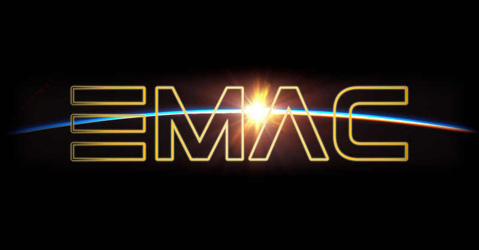

Introduction
===================================

Thanks to the unrivalled astrometric and photometric capabilities of the Gaia mission, new impetus has been given to the study of young stars: both from an *environmental* perspective, as members of comoving star-forming regions, and from an *individual* perspective, as targets amenable to planet-hunting direct-imaging observations.

In view of the large availability of theoretical evolutionary models, both fields would benefit from a unified framework that allows a straightforward comparison of physical parameters obtained by different stellar and substellar models.

To this aim, we developed the Manifold Age Determination for Young Stars (**MADYS**, IPA: /ˈmɑːdɪs/), a flexible Python tool for the age and mass determination of young stellar and substellar objects based on isochronal fitting.

The tool can be installed by following the guidelines provided in the :doc:`installation` section. Check the section "Using MADYS" to understand the capabilities of the code through several easily replicable examples.

Features
--------

* parameter estimation for directly-imaged objects based on the measured photometry;
* ability to automatically *retrieve* and *cross-match* photometry from several catalogs, including `Gaia DR2 <https://ui.adsabs.harvard.edu/#abs/2018A%26A...616A...1G/abstract>`_, `Gaia DR3 <https://ui.adsabs.harvard.edu/#abs/2022arXiv220800211G/abstract>`_, `Hipparcos <https://ui.adsabs.harvard.edu/abs/2007A%26A...474..653V/abstract>`_, `2MASS <https://ui.adsabs.harvard.edu/abs/2006AJ....131.1163S/abstract>`_, `ALLWISE <https://ui.adsabs.harvard.edu/abs/2014yCat.2328....0C/abstract>`_, `Panstarrs DR1 <https://ui.adsabs.harvard.edu/abs/2016arXiv161205560C/abstract>`_, `APASS DR9 <https://ui.adsabs.harvard.edu/abs/2016yCat.2336....0H/abstract>`_ and `SDSS DR13 <https://ui.adsabs.harvard.edu/abs/2017ApJS..233...25A/abstract>`_;
* possibility to assess the quality of photometric measurements and to impose custom rejection thresholds;
* possibility to create custom tables of objects to be analyzed, such as companions discovered in direct imaging observations;
* possibility to estimate interstellar extinction by integration of published 3D extinction maps;
* derivation of key (sub)stellar parameters (age, mass, radius, T_eff, log(L), log(g)), or at least meaningful constraints within the phase space if no age prior is provided;
* largest availability of models to date;
* capability to handle thousands of objects at once;
* presence of several dedicated plotting functions allowing a visual perception of the numerical output;
* conversion of contrast limits from direct imaging observations into mass limits;
* possibility to obtain individual astrophysical parameters for unresolved binaries, provided a mass ratio or a contrast measurement is available;
* extensive documentation, including a large variety of examples showing the possible applications of the tool.

Caveats & Bugs
--------
A thorough discussion on the assumptions behind our tool and on its limits of applicability is provided in `Squicciarini & Bonavita (2022) <https://ui.adsabs.harvard.edu/abs/2022A%26A...666A..15S/abstract>`_. 
Please refer to MADYS' `GitHub repository <https://github.com/vsquicciarini/madys>`_ to submit bugs and suggest new improvements to the code.

.. note::

   If you wish a new model to be included in a new version of MADYS, or a new set of photometric filters to be added to the current list, feel free to get in contact with us.

Attribution
--------
Please cite `Squicciarini & Bonavita (2022) <https://ui.adsabs.harvard.edu/abs/2022A%26A...666A..15S/abstract>`_ whenever you publish results obtained with MADYS.

Our code is also featured in the Astrophysics Source Code Library (`[ascl:2206.018] <https://ascl.net/2206.018>`_) and in the NASA EMAC platform (`[EMAC 2311-001] <https://emac.gsfc.nasa.gov?cid=2311-001>`_).

|pic1| |pic2| |pic3|

.. |pic1| image:: images/github.jpg
   :align: middle
   :alt: github logo
   :height: 150px
   :width: 150px
   :target: https://github.com/vsquicciarini/madys

Contents
--------

.. toctree::
   :maxdepth: 2
   :caption: Setup

   installation
   release_notes

.. toctree::
   :maxdepth: 2
   :caption: Fundamentals

   available_classes
   instance_creation
   extinction_model
   photometric_quality
   available_filters
   available_models
   
.. toctree::
   :maxdepth: 2
   :caption: Using MADYS

   computation_run
   binary_systems
   imaging_predictions
   contrast_curves
   
.. toctree::
   :maxdepth: 2
   :caption: Plotting utilities

   plotting_functions
   cmds
   
   
   
