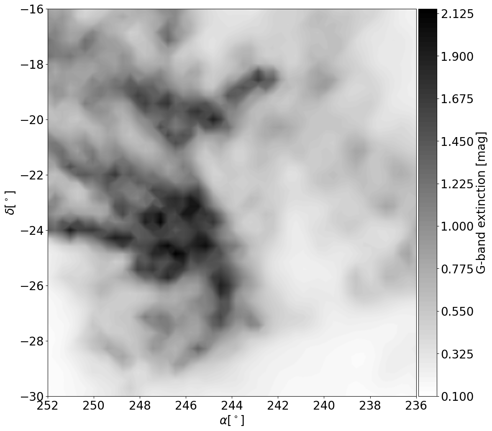
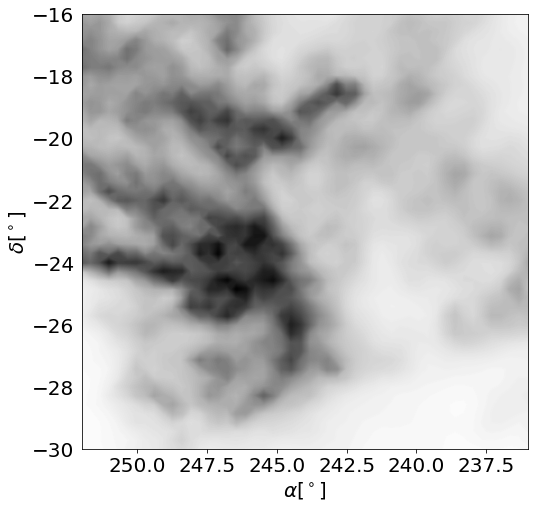
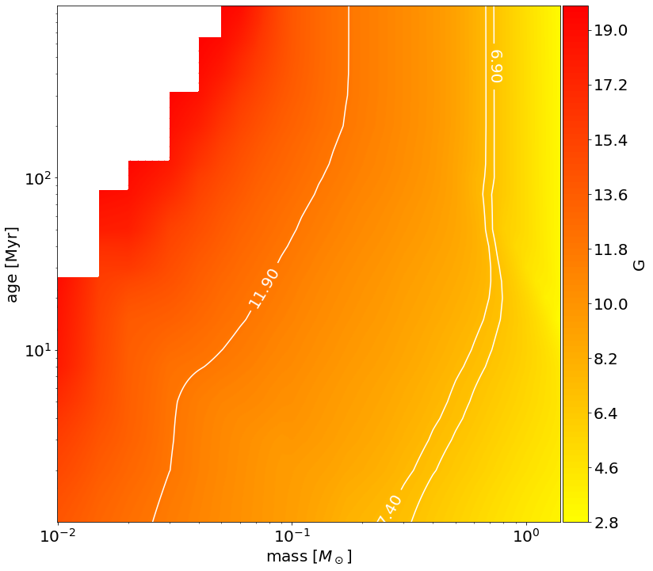
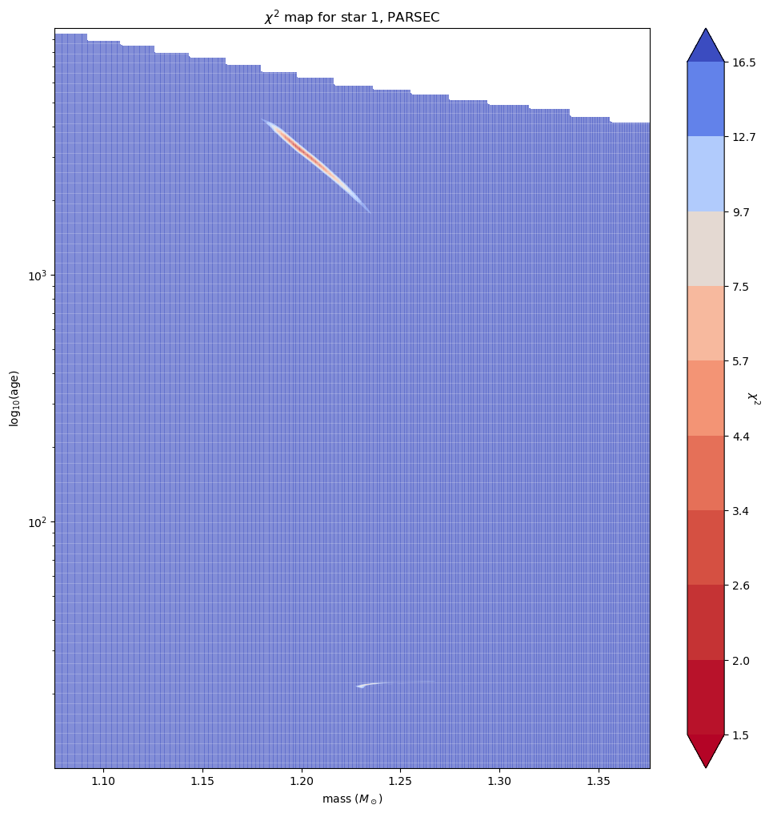
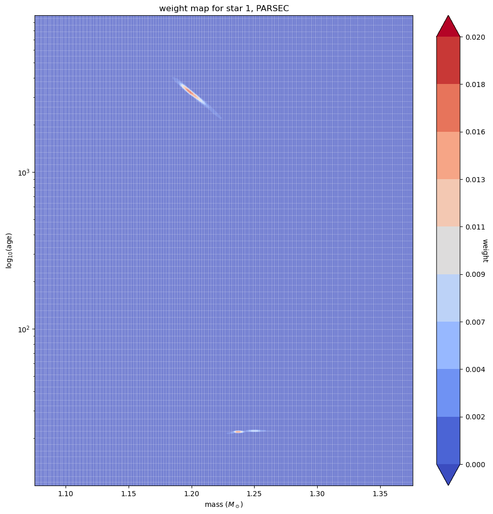

Plotting functions
=====

Extinction/Reddening maps
------------

The function :py:func:`SampleObject.plot_2D_ext` can be used to plot the integrated extinction along the line of sight, given as input a certain field of view. As a static method, it does not require the creation of a SampleObject instance.

Let us compute the integrated extinction expected at the coordinates and distance of the Upper Scorpius association, using the 3D extinction map by Leike et al. (2020).

>>> import numpy as np
>>> import matplotlib.pyplot as plt
>>> from madys import *
>>> 
>>> SampleObject.plot_2D_ext(ra=[236,252], dec=[-30,-16], d=160, color='G',reverse_xaxis=True,cmap='gray_r',fontsize=18)

The command will produce the following figure:

It is possible, through the keyword ``ax``, to plot the extinction map as a layer of an existing figure. Let us try, for instance, to plot some random points over the abovementioned extinction map:

>>> fontsize = 20
>>> fig, ax = plt.subplots(figsize=(8,8))
>>> SampleObject.plot_2D_ext(ra=[236,252],dec=[-30,-16],d=160,color='G',reverse_xaxis=True,cmap='gray_r',fontsize=fontsize,colorbar=False,ax=ax)
>>> ax.xaxis.set_tick_params(labelsize=fontsize)
>>> ax.yaxis.set_tick_params(labelsize=fontsize)
>>> ax.plot(240+5*np.random.rand(10),-25+5*np.random.rand(10), marker = '*', linestyle = '', color = 'red')
>>> plt.show()

Theoretical magnitudes across a grid
------------

The goal of the function :py:func:`IsochroneGrid.plot_iso_grid` is to plot the expected value of a given magnitude or color as a function of age and mass, given a certain model. This function is particularly useful to quickly visualize the age/mass range spanned by the selected model.

For instance, the command:

>>> IsochroneGrid.plot_iso_grid('G','bhac15',x_log=True,y_log=True,levels=[6.9,7.4,11.9],fontsize=20,cmap='autumn_r')

would yield Gaia's G magnitude across the BHAC15 grid. White areas represent regions that are outside the dynamical range of the model.

Mass/age posterior distributions of fitted objects
------------

After running :py:func:`SampleObject.get_params` upon a ``SampleObject`` instance, the results contained in the derived ``FitParams`` instance can be visually inspected through the function :py:func:`FitParams.plot_maps`. In particular, two quantities can be plotted:

* the reduced chi2 distributions of the fit as a function of mass and age, assuming nominal photometric measurements. This map has a straghtforward mathematical meaning;
* the weight map (cp. Squicciarini & Bonavita 2022), which provides the statistical weights of every point in the grid to get the final solution(s). This map is closer to what MADYS actually employs to derive the final estimates.

>>>#results is a FitParams instance
>>>results.plot_maps(dtype='weights')
>>>results.plot_maps(dtype='weights')

In this example, it is easily seen that a degeneracy exists for this star; hence, two solutions will be found for the star in the attribute ``all_solutions`` of the FitParams instance.

